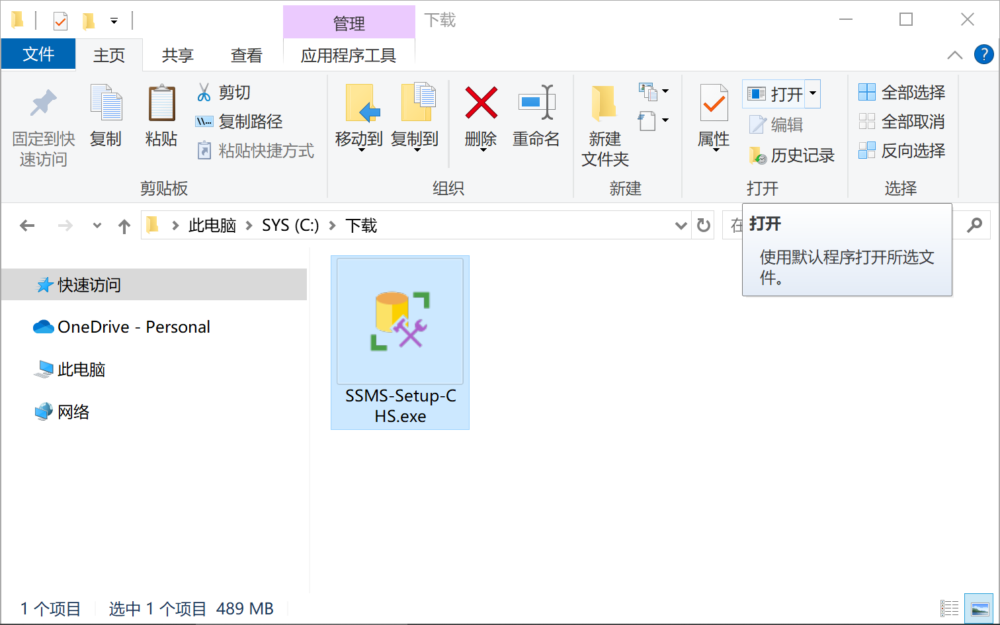

# 配置工作

## 下载 SQL Server Management Studio

下载地址：

> https://download.microsoft.com/download/9/b/e/9bee9f00-2ee2-429a-9462-c9bc1ce14c28/SSMS-Setup-CHS.exe

## 安装 SQL Server Management Studio

双击下载的安装程序：`SSMS-Setup-CHS.exe`

---

选择合适的安装位置，然后点击 `安装`

---

在可能出现的 `用户账户控制` 弹窗中点击 `是` 继续

---

等待安装程序完成

## 启动 SQL Server Management Studio

在开始菜单中搜索 `SQL Server Management Studio` 并点击 `打开`

## 登录 SQL Server

在连接到服务器的对话框中，切换身份验证方式为 `SQL Server 身份验证`，输入登录名和密码，然后点击 `连接`

:::tip[登录信息]
登录名：`sa`

密码为：之前安装时设定的密码
:::

## 连接成功

连接成功后，你将看到如下界面

这表示上一篇中的 `SQL Server 2019` 安装正常，可以进行后续的配置工作

## 配置 TCP/IP

为了支持应用程序连接数据库，还需要配置一些网络设置

### 打开 SQL Server 配置管理器

在开始菜单中搜索 `SQL Server 2019 配置管理器` 并点击 `打开`

### 启用 TCP/IP

选择 `SQL Server 网络配置` -> `MSSQLSERVER 的协议`

---

右键点击 `TCP/IP` 并选择 `启用`

### 重启 SQL Server 服务

程序会弹出提示框，重启计算机以应用更改

至此，`SQL Server 2019` 的配置工作完成
