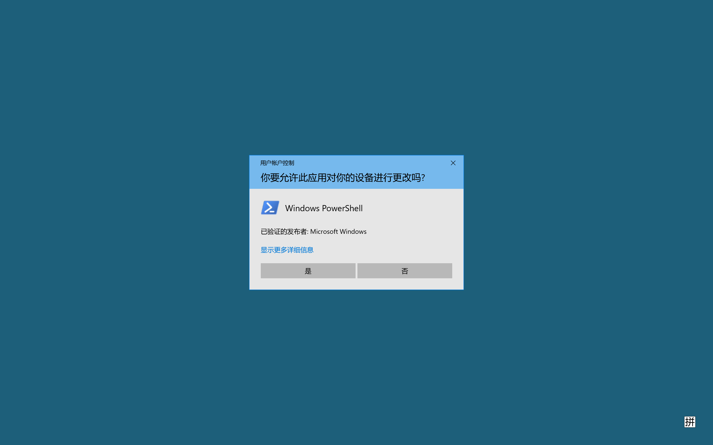
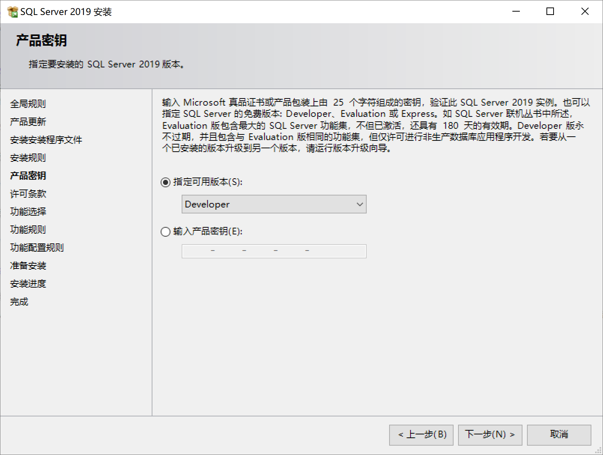
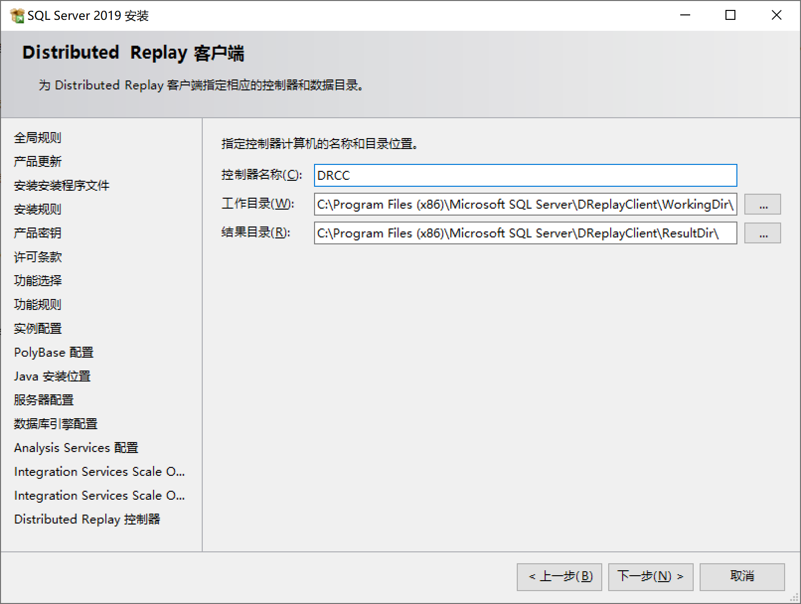

# 开始安装

## 安装中心

切换左侧为 `安装` 选项卡，然后点击 `全新 SQL Server 独立安装或向现有安装添加功能` 开始安装 SQL Server 2019。


## 产品更新

安装程序会检查 `全局规则` 和 `产品更新`，你可以 `跳过扫描` 或等待检查完成

点击 `下一步` 继续


## 安装规则

安装程序会检查 `安装安装程序文件` 和 `安装规则`

一般会显示 `Windows 防火墙` 的 `警告` 信息

> “Windows 防火墙”规则生成了警告。

> Windows
>
> 防火墙已启用。请确保相应端口已打开，以启用远程访问。若要了解为每项功能打开的端口，请参阅 https://go.microsoft.com/fwlink/?linkid=2094702
> 中的规则文档。

点击 `下一步` 继续


## 配置防火墙

在开始菜单中搜索 `Windows PowerShell` 并点击 `以管理员身份运行`


---

在可能出现的 `用户账户控制` 弹窗中点击 `是` 继续



---

启动后会显示 `管理员: Windows PowerShell` 窗口


请参阅下面的示例，打开 SQL Server 默认实例和 SQL Server Browser 服务的 TCP 端口 1433 和 UDP 端口 1434：

### SQLServer default instance

```pwsh
New-NetFirewallRule -DisplayName "SQLServer default instance" -Direction Inbound -LocalPort 1433 -Protocol TCP -Action Allow
```

复制上面的命令，然后粘贴到 `PowerShell` 窗口中，按 `Enter` 键执行


### SQLServer Browser service

```pwsh
New-NetFirewallRule -DisplayName "SQLServer Browser service" -Direction Inbound -LocalPort 1434 -Protocol UDP -Action Allow
```

同样的，复制上面的命令，然后粘贴到 `PowerShell` 窗口中，按 `Enter` 键执行


---

在开始菜单中搜索 `高级安全 Windows Defender 防火墙`，并点击 `打开`


## 检查入站规则

切换到 `入站规则` 选项卡，可以看到刚才添加的 2 条规则


至此，`Windows 防火墙` 配置完成

## 产品密钥

在`产品密钥`步骤，选择指定可用版本为 `Developer`，然后点击 `下一步` 继续



## 许可条款

在许可条款步骤，请仔细阅读并选择 `我接受许可条款和隐私声明`

然后点击 `下一步` 继续


## 功能选择

在 `功能选择` 步骤，先全选，然后取消 `机器学习服务和语言扩展` 和 `机器学习服务器(独立)` 2 个选项

> 注意必须取消这 2 个选项，否则会导致安装失败

然后点击 `下一步` 继续


## 实例配置

在 `实例配置` 步骤，选择 `默认实例`，然后点击 `下一步` 继续


## PolyBase 配置

在 `PolyBase 配置`步骤，直接点击 `下一步` 继续


## Java 安装位置

在 `Java 安装位置` 步骤，直接点击 `下一步` 继续


## 服务器配置

在 `服务器配置` 步骤，直接点击 `下一步` 继续


## 数据库引擎配置

在 `数据库引擎配置` 步骤，选择 `混合模式`，然后设置 `系统管理员` 的密码并点击 `添加当前用户`

> 请记住这个密码
>
> 请勿使用类似 `123456` 这样的简单密码

然后点击 `下一步` 继续


## Analysis Service 配置

在 `Analysis Service 配置` 步骤，点击 `添加当前用户`

然后点击 `下一步` 继续


## Integration Service Scale Out 配置 - 主节点

在 `Integration Service Scale Out 配置 - 主节点` 步骤，直接点击 `下一步` 继续


## Integration Service Scale Out 配置 - 辅助角色节点

在 `Integration Service Scale Out 配置 - 辅助角色节点` 步骤，直接点击 `下一步` 继续


## Distributed Replay 控制器

在 `Distributed Replay 控制器` 步骤，点击 `添加当前用户`

然后点击 `下一步` 继续


## Distributed Replay 客户端

在 `Distributed Replay 客户端` 步骤，输入控制器名称，比如（JOYUAI）

> 请记住这个名称

然后点击 `下一步` 继续



## 准备安装

在 `准备安装` 步骤，点击 `安装` 开始安装


## 安装完成

待安装完成后，点击 `关闭` 按钮以关闭安装程序，然后重启计算机


至此，`SQL Server 2019` 安装完成
