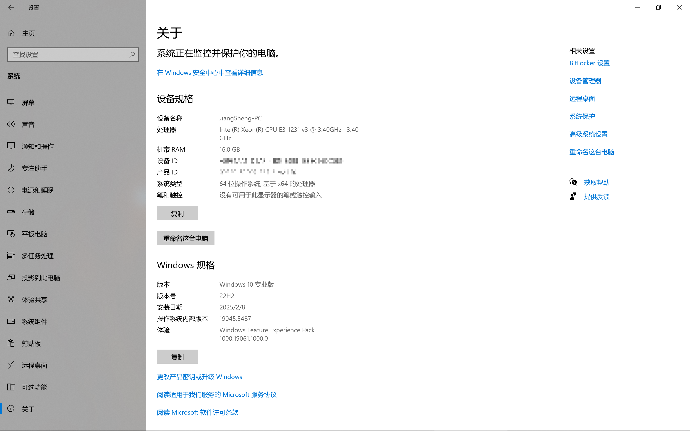
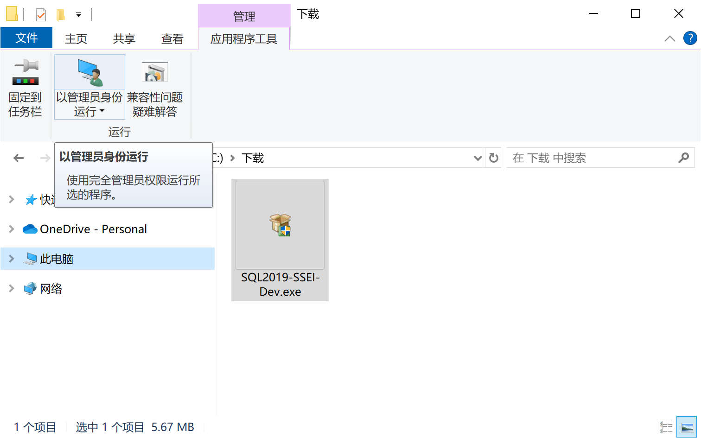
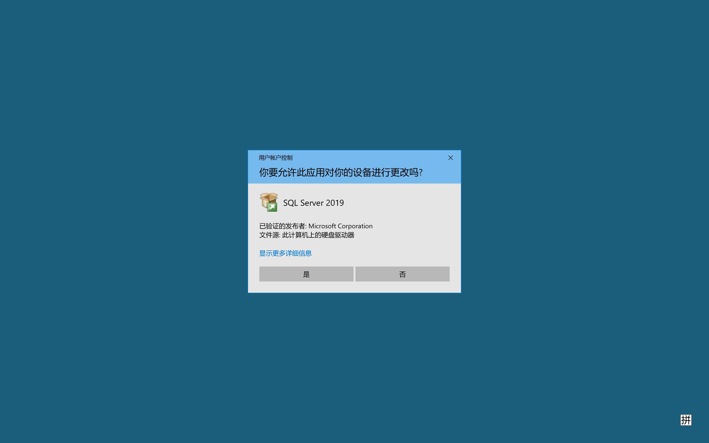
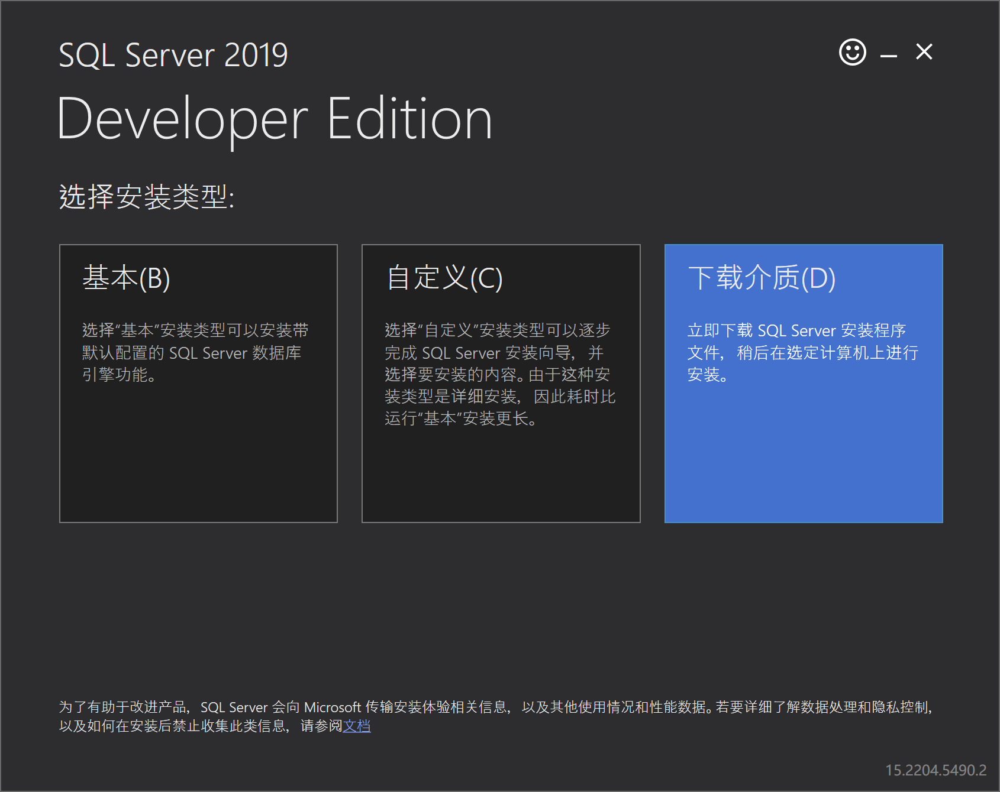
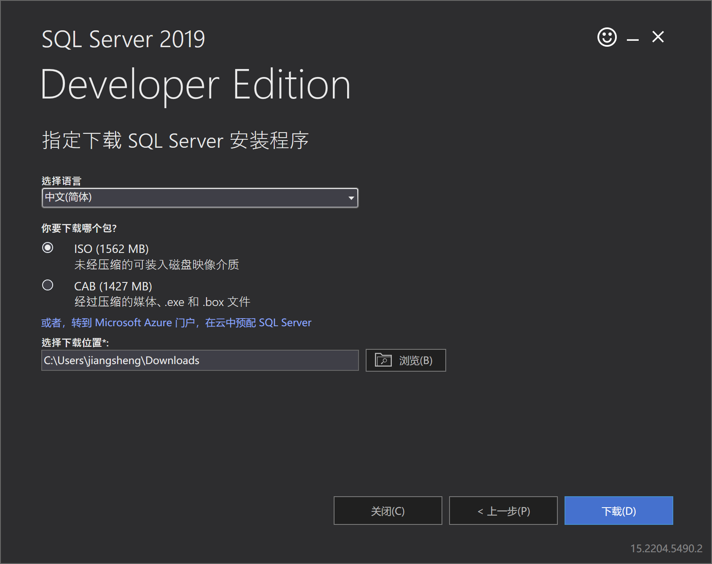
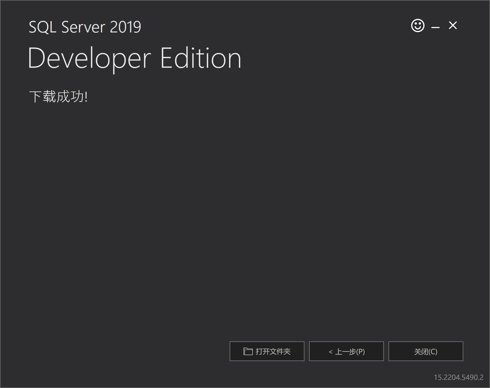
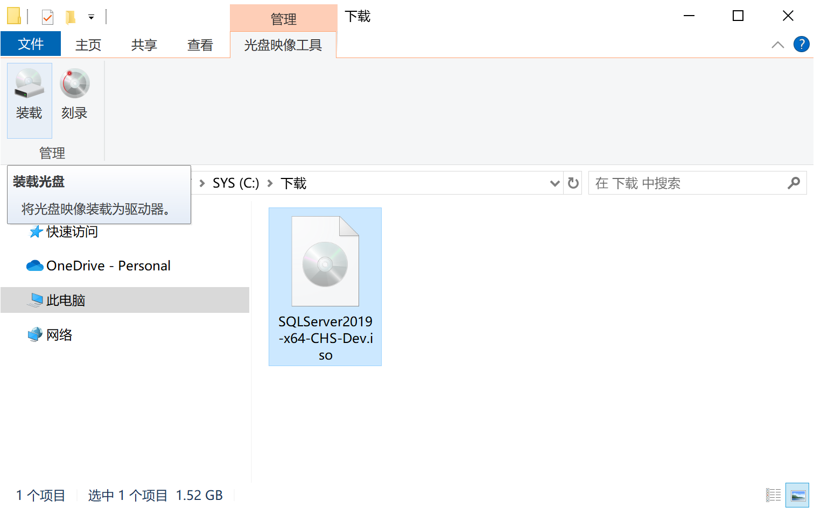
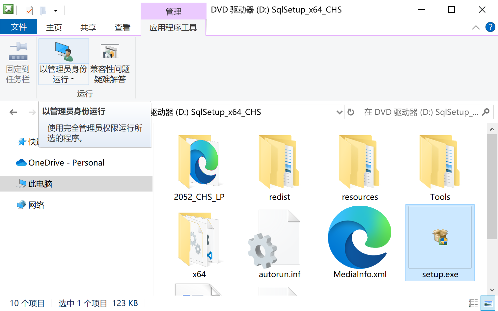
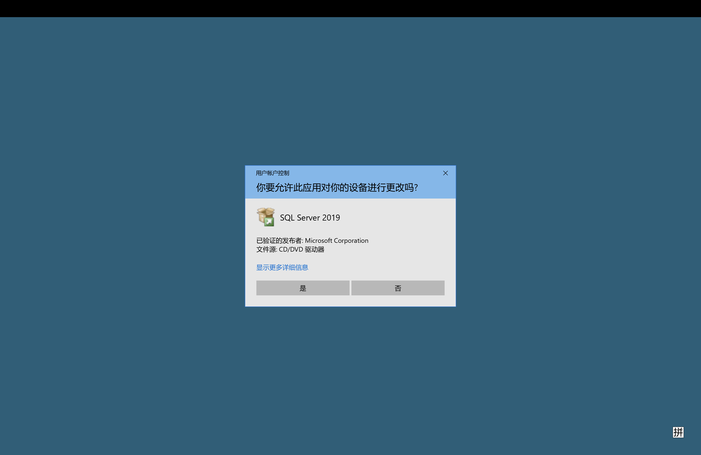
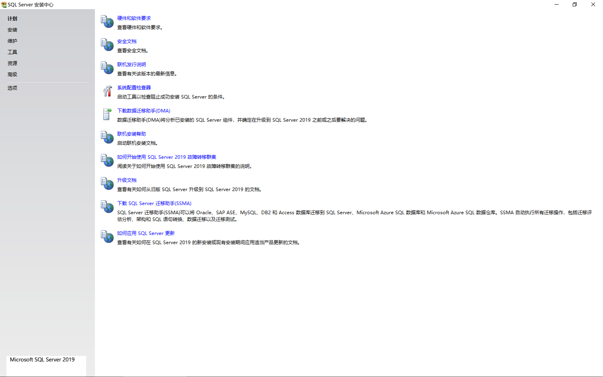

# 准备工作

## 系统要求

- 版本：Windows 10 专业版 (Pro) 或更高版本
- 版本号：22H2 或更高版本
- 系统类型：64 位操作系统, 基于 x64 的处理器

:::tip[如何检查系统信息]

1. 开始菜单 - 设置 - 系统 - 关于
2. 或者，可在开始菜单中搜索 `电脑信息` 查看详细的信息，包括操作系统版本、系统类型等。

:::

:::info[安装提示]
如果你的系统不满足上述要求，也可以尝试安装，但该方式未经测试，可能会遇到未知问题。
:::

## 下载安装器

下载地址：

> https://download.microsoft.com/download/d/a/2/da259851-b941-459d-989c-54a18a5d44dd/SQL2019-SSEI-Dev.exe

:::tip[网络环境]

请确保下载时网络连接稳定。如果在公司网络环境下遇到下载异常，可尝试切换到其他网络环境。

:::

###

下载完成后，以管理员身份运行被下载的安装程序：`SQL2019-SSEI-Dev.exe`

---

在可能出现的 `用户账户控制` 弹窗中点击 `是` 继续

## 下载介质

等待安装程序加载完成后，选择安装类型为：`下载介质`

:::note[磁盘空间检查]
下载介质可能会占用较大磁盘空间。请确保目标磁盘至少有足够的可用空间（例如建议预留至少20GB），以避免下载或后续安装过程中出现问题。
:::

---

- 选择语言为：`中文(简体)`
- 包类型为：`ISO`
- 选择合适的下载位置后，点击 `下载`

:::info[下载位置]

请记住你选择的**下载位置**，以便后续装载光盘镜像文件。

:::

:::warning[下载错误处理]
如果在下载过程中遇到错误（例如网络连接不稳定或服务器问题），请尝试以下步骤：

1. 检查网络连接是否正常；
2. 更换网络环境后重新尝试下载；
3. 若问题持续存在，请联系系统管理员或查阅相关支持文档。
   :::

## 下载完成

下载成功后，你将看到如下提示：

点击 `打开文件夹`，并找到下载的镜像文件：

`SQLServer2019-x64-CHS-Dev.iso`

---

## 装载光盘镜像

1. 右键点击 `SQLServer2019-x64-CHS-Dev.iso` 文件，并选择 `装载`；系统将自动将该镜像作为虚拟光驱挂载。
2. 若需卸载虚拟光驱，可右键点击对应的光驱并选择 `弹出`。

## 启动安装器

在装载后的驱动器中，以管理员身份运行：`setup.exe`

---

在可能出现的 `用户账户控制` 弹窗中点击 `是` 继续

:::warning[启动安装器问题排查]
如果在启动安装器过程中遇到以管理员身份运行失败或用户账户控制弹窗不出现的问题，请参考以下建议：

- **确认管理员权限：** 请确保当前账户具备管理员权限，并通过右键 `以管理员身份运行` 启动 `setup.exe`；

:::

## 安装中心界面

你将看到如下的安装程序界面：

至此，准备工作完成
