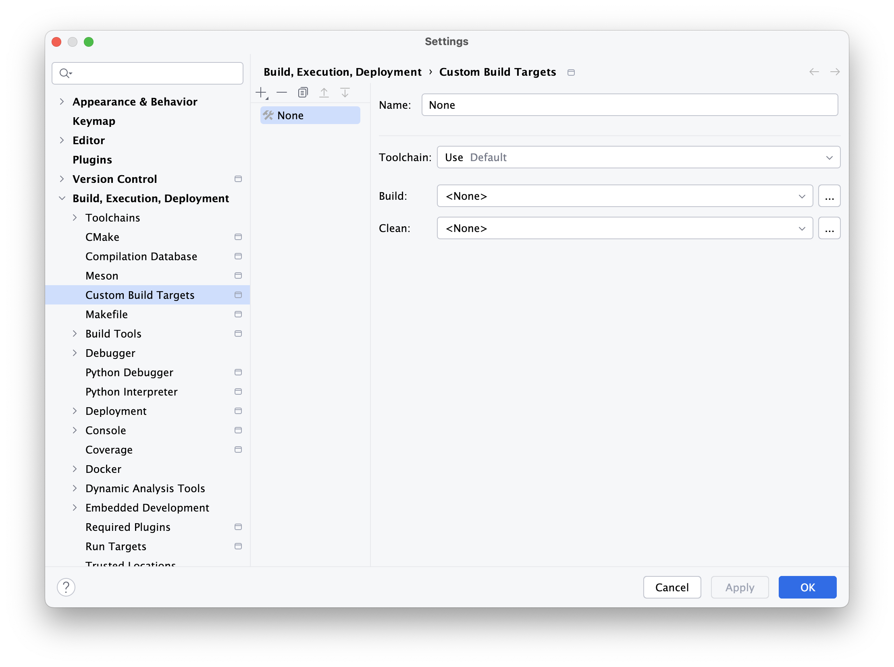
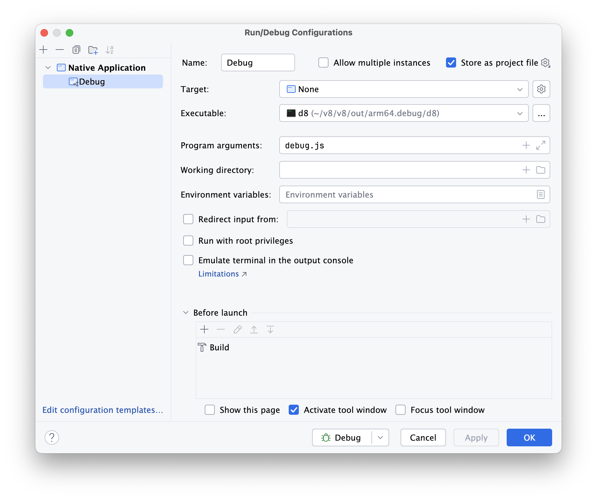
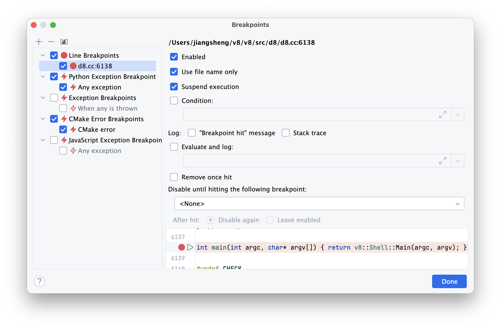
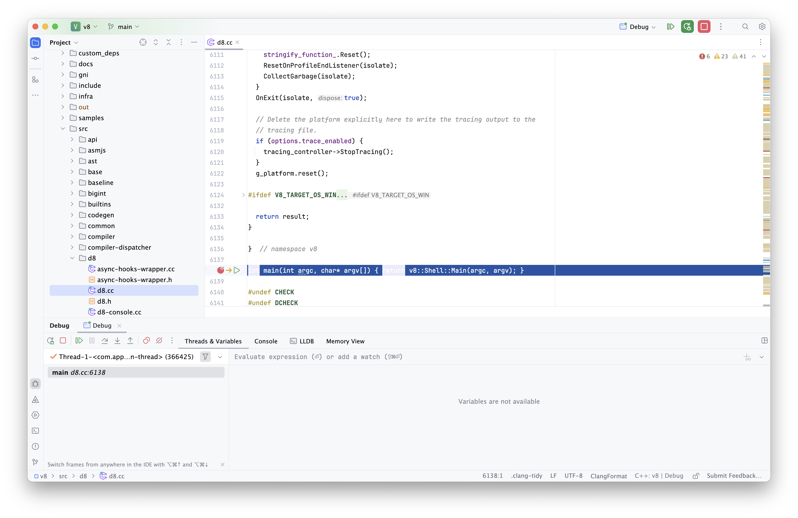
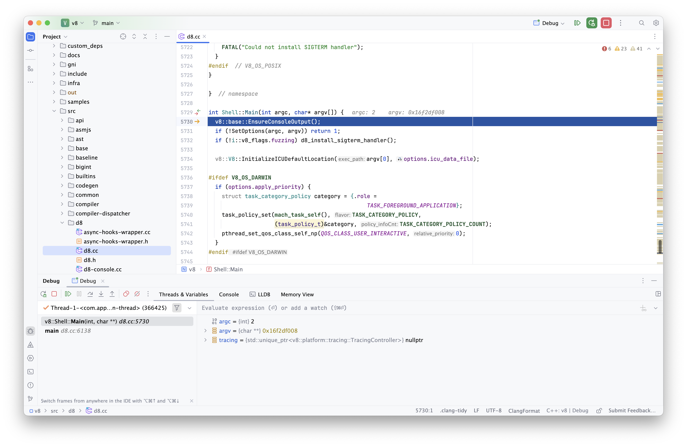

# 使用 CLion 调试

通过 CLion 调试 V8 源代码，即便 V8 本身并非基于 CMake 构建。

## 项目初始化

首先，参考前文将 V8 代码仓库克隆到本地，并使用 CLion 打开项目：

```shell
cd ~/v8/v8
clion .
```

## 优化调试体验（可选）

为了在 CLion 中获取更佳的调试体验，尽管 V8 不是一个基于 CMake 的项目，也可以通过创建一个简单的 `CMakeLists.txt` 文件来「欺骗」CLion，从而激活代码导航等功能。这一步骤不涉及实际的构建过程。

在项目根目录下执行以下命令创建 `CMakeLists.txt` 文件：

```shell
touch CMakeLists.txt
```

然后，向 `CMakeLists.txt` 文件中添加以下内容：

```txt
cmake_minimum_required(VERSION 3.28)
project(v8)
include_directories(./)
set(CMAKE_CXX_STANDARD 17)
add_executable(v8 src/d8/d8.cc)
file(GLOB_RECURSE SRC_SOURCES "src/*.cc")
file(GLOB_RECURSE INCLUDE_SOURCES "include/*.cc")
set(ALL_SOURCES ${SRC_SOURCES} ${INCLUDE_SOURCES})
list(REMOVE_ITEM ALL_SOURCES "${CMAKE_CURRENT_SOURCE_DIR}/src/d8/d8.cc")
add_library(CoreLib STATIC ${ALL_SOURCES})
target_link_libraries(v8 CoreLib)
```

## 添加调试目标

为了在 CLion 中调试 V8 引擎执行的 JavaScript 代码，需要创建一个 JavaScript 文件作为调试入口。

创建一个名为 `debug.js` 的 JavaScript 文件，并将其放置在 `out/arm64.debug` 目录。

执行以下命令以创建文件并用 CLion 打开它：

```shell
touch out/arm64.debug/debug.js
clion out/arm64.debug/debug.js
```

在 `debug.js` 文件中，添加一些简单的 JavaScript 代码用于测试：

```javascript
let a = 1;
var b = 2;
const c = 3;
console.log(a + b + c);
```

## 新增配置

为了调试而无需进行实际的构建过程，通过添加自定义构建目标来实现。

### 自定义构建目标

1. 打开 CLion 的偏好设置：选择菜单中的 `CLion` -> `Settings...`。

2. 在偏好设置对话框中，导航到 `Settings` | `Build, Execution, Deployment` | `Custom Build Targets` 。

3. 点击左上角的加号来添加一个新的自定义构建目标。

4. 在新的自定义构建目标设置框中，进行以下配置：

   - Name: `None`
   - Toolchain: `Use Default`
   - Build: `<None>`
   - Clean: `<None>`

   

5. 完成配置后，点击 `OK` 或 `Apply` 保存更改。

### 运行/调试配置

1. 打开 `Run` -> `Edit Configurations...`

2. 点击左上角的加号，选择 `Native Application`。

3. 配置详情：

   - Name: `Debug`
   - Target: `None`
   - Executable: `$PROJECT_DIR$/out/arm64.debug/d8`
   - Program arguments: `debug.js`
   - 其它设置保持默认。

   

选中 `Store as Project file` 后将自动保存配置至 `.run/Debug.run.xml` 文件。其内容如下：

```xml
<component name="ProjectRunConfigurationManager">
  <configuration default="false" name="Debug" type="CLionNativeAppRunConfigurationType" PROGRAM_PARAMS="debug.js"
    REDIRECT_INPUT="false" ELEVATE="false" USE_EXTERNAL_CONSOLE="false" EMULATE_TERMINAL="false"
    PASS_PARENT_ENVS_2="true" PROJECT_NAME="v8" TARGET_NAME="None" CONFIG_NAME="None" version="1"
    RUN_PATH="$PROJECT_DIR$/out/arm64.debug/d8">
    <method v="2">
      <option name="CLION.COMPOUND.BUILD" enabled="true"/>
    </method>
  </configuration>
</component>
```

## 设置断点

1. 打开 `d8.cc` 文件：

   ```shell
   clion src/d8/d8.cc
   ```

2. 在文件末尾的 `main` 函数处设置断点，并右键选择 `Use file name only`。

   

## 开始调试

点击右上角的甲虫图标启动调试。

程序将在 `main` 函数处暂停。



至此，可以愉快的进行调试了，比如 `Step Into` 一个函数。


