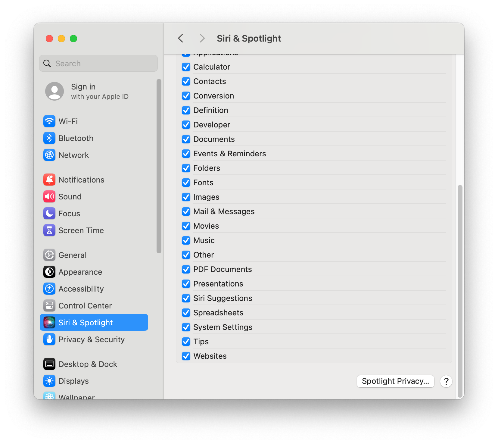
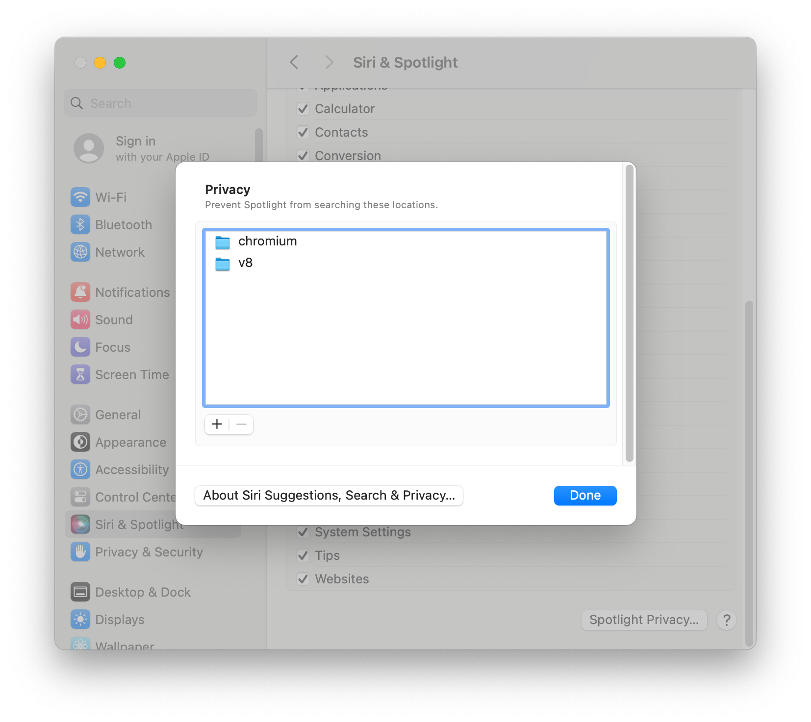

# 获取 V8 源代码

## 说明

1. 在 macOS 上，首先安装 Git，然后安装 [`depot_tools`](./get-depot-tools)。

2. 通过在你的终端中执行以下命令来更新 `depot_tools`。

   ```shell
   gclient
   ```

3. 省略

4. 现在，获取 V8 源代码，包括所有分支和依赖项：

   ```shell
   mkdir ~/v8
   cd ~/v8
   fetch v8
   cd v8
   ```

在那之后，你会故意处于一个分离头状态。

你可以选择性地指定新分支应如何被跟踪：

```shell
git config branch.autosetupmerge always
git config branch.autosetuprebase always
```

或者，你可以像这样创建新的本地分支（推荐）：

```shell
git new-branch fix-bug-1234
```

## 保持最新状态

使用 `git pull` 更新你当前的分支。请注意，如果你不在一个分支上，`git pull` 将无法工作，你需要改用 `git fetch`。

```shell
git pull
```

有时 V8 的依赖项会更新。你可以通过运行以下命令来同步这些更新：

```shell
gclient sync
```

## 设置聚焦隐私（可选）

从「聚焦」搜索中排除源代码文件夹。





从「聚焦」搜索中排除特定文件和文件夹。请参阅 [防止「聚焦」在文件中搜索](https://support.apple.com/zh-cn/guide/mac-help/mchl1bb43b84/14.0/mac/14.0)。
